# 🏗️ IaC Testing Framework - Comprehensive Architecture Diagram

## 📋 Overview
This diagram illustrates the complete interaction flow between all components of the Infrastructure as Code (IaC) Testing Framework, showing how static analysis, policy compliance, dynamic testing, CI/CD integration, and evaluation work together.

## 🔄 Complete Architecture Flow

```mermaid
graph TB
    %% Entry Points
    CLI[🖥️ CLI Interface<br/>cli.py] --> CR[🚀 Comprehensive Runner<br/>comprehensive_runner.py]
    USER[👤 User] --> CLI
    
    %% Main Orchestrator
    CR --> SA[🔍 Static Analysis<br/>static_checker.py]
    CR --> PC[📋 Policy Compliance<br/>compliance_checker.py]
    CR --> DT[⚡ Dynamic Testing<br/>dynamic_tester.py]
    CR --> CI[🔄 CI/CD Integration<br/>ci_integration.py]
    CR --> EV[📊 Evaluation<br/>evaluator.py]
    
    %% Static Analysis Components
    SA --> TF1[📄 Terraform Files<br/>*.tf]
    SA --> TFLINT[🔧 TFLint Tool]
    SA --> CHECKOV[🛡️ Checkov Tool]
    SA --> TERRAFORM[🌍 Terraform Validate]
    
    %% Policy Compliance Components
    PC --> POLICIES[📜 Policy Files<br/>*.yaml]
    PC --> OPA[⚖️ Open Policy Agent]
    PC --> CUSTOM[🎯 Custom Rules]
    
    %% Dynamic Testing Components
    DT --> AWS[☁️ AWS Environment]
    DT --> LOCALSTACK[🐳 LocalStack Environment]
    DT --> TERRAFORM2[🌍 Terraform Deploy]
    DT --> RUNTIME[🧪 Runtime Tests]
    
    %% CI/CD Components
    CI --> GITHUB[🐙 GitHub Actions]
    CI --> JENKINS[🔨 Jenkins Pipeline]
    CI --> DOCKER[🐳 Docker Containers]
    
    %% Evaluation Components
    EV --> METRICS[📈 Metrics Collection]
    EV --> REPORTS[📄 Report Generation]
    EV --> DASHBOARD[📊 Dashboard Output]
    
    %% Output Components
    SA --> JSON1[📝 JSON Reports]
    PC --> JSON2[📝 JSON Reports]
    DT --> JSON3[📝 JSON Reports]
    EV --> JSON4[📝 JSON Reports]
    
    %% Final Outputs
    JSON1 --> FINAL[📋 Comprehensive Report]
    JSON2 --> FINAL
    JSON3 --> FINAL
    JSON4 --> FINAL
    
    FINAL --> OUTPUT[📤 Final Output<br/>- CLI Display<br/>- File Reports<br/>- Dashboard]
    
    %% Styling
    classDef primary fill:#e1f5fe,stroke:#01579b,stroke-width:2px,color:#000
    classDef secondary fill:#f3e5f5,stroke:#4a148c,stroke-width:2px,color:#000
    classDef tools fill:#e8f5e8,stroke:#1b5e20,stroke-width:2px,color:#000
    classDef output fill:#fff3e0,stroke:#e65100,stroke-width:2px,color:#000
    
    class CLI,CR primary
    class SA,PC,DT,CI,EV secondary
    class TFLINT,CHECKOV,TERRAFORM,OPA,AWS,LOCALSTACK,GITHUB,JENKINS,DOCKER tools
    class JSON1,JSON2,JSON3,JSON4,FINAL,OUTPUT output
```



## 🔍 Component Interaction Details

### 1. **Entry Point & Orchestration**

#### CLI Interface (`cli.py`)
```python
# Entry point for the framework
def main():
    parser = argparse.ArgumentParser(description='IaC Testing Framework')
    parser.add_argument('test_type', choices=['static', 'policy', 'dynamic', 'comprehensive'])
    parser.add_argument('terraform_dir', help='Directory containing Terraform files')
    args = parser.parse_args()
    
    runner = ComprehensiveTestRunner()
    if args.test_type == 'comprehensive':
        runner.run_comprehensive_analysis(args.terraform_dir)
```

#### Comprehensive Runner (`comprehensive_runner.py`)
```python
class ComprehensiveTestRunner:
    def __init__(self):
        self.static_checker = StaticChecker()
        self.compliance_checker = ComplianceChecker()
        self.dynamic_tester = DynamicTester()
        self.ci_integration = CICDIntegration()
        self.evaluator = FrameworkEvaluator()
    
    def run_comprehensive_analysis(self, terraform_dir: str):
        # Orchestrate all testing phases
        static_results = self.run_static_analysis(terraform_dir)
        policy_results = self.run_policy_compliance(terraform_dir)
        dynamic_results = self.run_dynamic_testing(terraform_dir)
        return self._combine_results(static_results, policy_results, dynamic_results)
```

### 2. **Static Analysis Pipeline**

#### Static Checker (`static_analysis/static_checker.py`)
```python
class StaticChecker:
    def analyze_terraform_files(self, terraform_dir: str) -> dict:
        results = {
            "tflint": self.run_tflint(terraform_dir),
            "checkov": self.run_checkov(terraform_dir),
            "terraform_validate": self.run_terraform_validate(terraform_dir),
            "syntax_check": self.run_syntax_check(terraform_dir)
        }
        return self._process_results(results)
    
    def run_tflint(self, terraform_dir: str) -> dict:
        # Execute TFLint for Terraform linting
        result = subprocess.run(['tflint', '--format=json'], 
                              capture_output=True, text=True)
        return json.loads(result.stdout) if result.returncode == 0 else {}
```

### 3. **Policy Compliance Pipeline**

#### Compliance Checker (`policy_compliance/compliance_checker.py`)
```python
class ComplianceChecker:
    def __init__(self, policies_dir: str = "policies"):
        self.policies = self._load_policies()
    
    def check_compliance(self, terraform_dir: str) -> dict:
        results = {
            "checkov_policies": self.run_checkov_policies(terraform_dir),
            "opa_policies": self.run_opa_policies(terraform_dir),
            "custom_rules": self.run_custom_rules(terraform_dir)
        }
        return self._evaluate_compliance(results)
    
    def run_checkov_policies(self, terraform_dir: str) -> dict:
        # Run Checkov for policy compliance
        result = subprocess.run(['checkov', '-d', terraform_dir, '--output', 'json'],
                              capture_output=True, text=True)
        return json.loads(result.stdout)
```

### 4. **Dynamic Testing Pipeline**

#### Dynamic Tester (`dynamic_provisioning/dynamic_tester.py`)
```python
class DynamicTester:
    def __init__(self, test_environment: str = "localstack"):
        self.test_environment = test_environment
        self.aws_clients = self._init_clients()
    
    def deploy_infrastructure(self, terraform_dir: str) -> dict:
        # Deploy infrastructure using Terraform
        os.chdir(terraform_dir)
        
        # Initialize Terraform
        subprocess.run(['terraform', 'init'], check=True)
        
        # Plan and Apply
        subprocess.run(['terraform', 'plan', '-out=tfplan'], check=True)
        result = subprocess.run(['terraform', 'apply', 'tfplan'], 
                              capture_output=True, text=True)
        
        return {"status": "success" if result.returncode == 0 else "failed"}
    
    def run_runtime_tests(self, terraform_dir: str) -> dict:
        # Test deployed infrastructure
        tests = [
            self._test_s3_bucket_exists(),
            self._test_ec2_instance_running(),
            self._test_security_groups(),
            self._test_iam_roles()
        ]
        return self._aggregate_test_results(tests)
```

### 5. **CI/CD Integration**

#### CI Integration (`ci_cd/ci_integration.py`)
```python
class CICDIntegration:
    def generate_github_workflow(self, project_path: str) -> dict:
        workflow_content = """
name: IaC Testing Pipeline
on: [push, pull_request]
jobs:
  iac-testing:
    runs-on: ubuntu-latest
    steps:
      - uses: actions/checkout@v2
      - name: Run Static Analysis
        run: python comprehensive_runner.py static ./terraform
      - name: Run Policy Compliance
        run: python comprehensive_runner.py policy ./terraform
      - name: Run Dynamic Testing
        run: python comprehensive_runner.py dynamic ./terraform
"""
        return {"workflow": workflow_content, "status": "generated"}
```

### 6. **Evaluation & Reporting**

#### Framework Evaluator (`evaluation/evaluator.py`)
```python
class FrameworkEvaluator:
    def evaluate_results(self, all_results: dict) -> dict:
        metrics = {
            "static_analysis_score": self._calculate_static_score(all_results['static']),
            "policy_compliance_score": self._calculate_policy_score(all_results['policy']),
            "dynamic_testing_score": self._calculate_dynamic_score(all_results['dynamic']),
            "overall_quality_score": self._calculate_overall_score(all_results)
        }
        
        return {
            "metrics": metrics,
            "recommendations": self._generate_recommendations(metrics),
            "summary": self._generate_summary(metrics)
        }
```

## 🔄 Data Flow Sequence


## 🧩 Component Dependencies

### **Core Dependencies**
```python
# comprehensive_runner.py imports
from static_analysis.static_checker import StaticChecker
from policy_compliance.compliance_checker import ComplianceChecker
from dynamic_provisioning.dynamic_tester import DynamicTester
from ci_cd.ci_integration import CICDIntegration
from evaluation.evaluator import FrameworkEvaluator
```

### **External Tool Dependencies**
- **TFLint**: Terraform linting
- **Checkov**: Security and policy scanning
- **Terraform**: Infrastructure deployment
- **AWS CLI/SDK**: Cloud resource management
- **Docker**: LocalStack containerization

### **Python Package Dependencies**
```python
# requirements.txt key dependencies
boto3>=1.26.0        # AWS SDK
pyyaml>=6.0          # YAML parsing
requests>=2.28.0     # HTTP requests
docker>=6.0.0        # Docker integration
```

## 📊 Output Flow

### **Report Generation Flow**
```
Individual Component Results → JSON Aggregation → Comprehensive Analysis → Final Reports
                                       ↓
                              ┌─────────────────┐
                              │  JSON Reports   │
                              │  • Static       │
                              │  • Policy       │
                              │  • Dynamic      │
                              │  • Evaluation   │
                              └─────────────────┘
                                       ↓
                              ┌─────────────────┐
                              │ Final Dashboard │
                              │  • CLI Output   │
                              │  • File Reports │
                              │  • Metrics      │
                              └─────────────────┘
```

### **Sample Integration Code**
```python
# Example of how components interact in comprehensive_runner.py
def run_comprehensive_analysis(self, terraform_dir: str) -> dict:
    results = {}
    
    # Phase 1: Static Analysis
    print("🔍 Running Static Analysis...")
    results['static'] = self.static_checker.analyze_terraform_files(terraform_dir)
    
    # Phase 2: Policy Compliance
    print("📋 Running Policy Compliance...")
    results['policy'] = self.compliance_checker.check_compliance(terraform_dir)
    
    # Phase 3: Dynamic Testing
    print("⚡ Running Dynamic Testing...")
    deployment = self.dynamic_tester.deploy_infrastructure(terraform_dir)
    if deployment['status'] == 'success':
        results['dynamic'] = self.dynamic_tester.run_runtime_tests(terraform_dir)
        # Cleanup resources (can be disabled for demo)
        # self.dynamic_tester.cleanup_deployment(terraform_dir)
    
    # Phase 4: Evaluation
    print("📊 Running Evaluation...")
    results['evaluation'] = self.evaluator.evaluate_results(results)
    
    return results
```

## 🎯 Key Interaction Points

1. **CLI → Comprehensive Runner**: Command parsing and orchestration
2. **Static Checker → External Tools**: TFLint, Checkov, Terraform validation
3. **Dynamic Tester → Cloud Providers**: AWS/LocalStack deployment and testing
4. **Compliance Checker → Policy Engines**: OPA, Checkov policy evaluation
5. **Evaluator → All Components**: Metrics aggregation and scoring
6. **CI Integration → External Systems**: GitHub Actions, Jenkins pipelines

This architecture enables comprehensive testing of Infrastructure as Code with clear separation of concerns, modularity, and extensibility for future enhancements.
