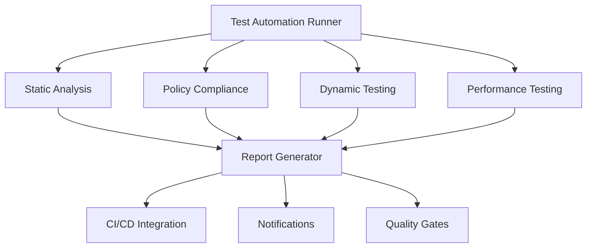

# IaC Testing Framework - Enterprise Edition

A comprehensive, production-ready testing framework for Infrastructure as Code (IaC) validation, security compliance, automated testing, and CI/CD integration. This framework provides end-to-end testing capabilities for enterprise environments with real-world scenarios and performance benchmarking.

## 🌟 Features

### Core Testing Capabilities
- **Static Analysis**: Advanced Terraform code validation, linting, and best practices checking
- **Security Compliance**: Policy-based security checks with industry standards (AWS, CIS, SOC2, GDPR)
- **Dynamic Testing**: Real infrastructure provisioning and testing with LocalStack integration
- **Performance Testing**: Load testing, scalability analysis, and performance benchmarking
- **End-to-End Testing**: Complete workflow validation with real-world scenarios
- **Real-World Integration**: Enterprise scenarios including financial, healthcare, and microservices

### CI/CD Integration
- **GitHub Actions**: Complete workflow with parallel testing and reporting
- **Jenkins**: Pipeline with parameterized builds and notifications
- **GitLab CI**: Multi-stage pipeline with service integration
- **Production Integration**: Pre/post-deployment validation with quality gates

### Advanced Features
- **Automated Reporting**: HTML, JSON, and JUnit XML reports with dashboards
- **Notification System**: Slack, Teams, and email integration
- **Quality Gates**: Compliance thresholds and deployment gates
- **Rollback Automation**: Intelligent rollback recommendations
- **Multi-Environment**: Development, staging, and production configurations

## 🚀 Quick Start

### Installation

1. **Clone the repository**:
```bash
git clone <repository-url>
cd iac-testing-framework
```

2. **Install Python dependencies**:
```bash
pip install -r requirements.txt
```

3. **Install required tools**:
```bash
# Install Terraform
wget https://releases.hashicorp.com/terraform/1.6.0/terraform_1.6.0_windows_amd64.zip
unzip terraform_1.6.0_windows_amd64.zip

# Install Checkov
pip install checkov

# Install TFLint
curl -s https://raw.githubusercontent.com/terraform-linters/tflint/master/install_linux.sh | bash
```

4. **Setup LocalStack** (for dynamic testing):
```bash
docker-compose up -d localstack
```

### Basic Usage

**Run comprehensive testing**:
```bash
python run_tests.py --tests static policy e2e --format json html
```

**Run specific test suite**:
```bash
python comprehensive_runner.py
```

**Run real-world scenarios**:
```bash
python tests/integration/real_world_tester.py
```

**Run performance testing**:
```bash
python tests/performance/performance_tester.py
```

## 📁 Project Structure

```
iac-testing-framework/
├── 📋 Core Framework
│   ├── comprehensive_runner.py       # Main test orchestrator
│   ├── test_framework.py            # Core testing framework
│   ├── run_tests.py                 # Automated test runner
│   └── production_integration.py    # Production deployment integration
│
├── 🔍 Testing Components
│   ├── static_analysis/             # Static code analysis
│   │   ├── static_checker.py
│   │   └── examples/
│   ├── policy_compliance/           # Security and compliance
│   │   ├── compliance_checker.py
│   │   └── policies/
│   ├── dynamic_provisioning/        # Infrastructure testing
│   │   └── dynamic_tester.py
│   └── evaluation/                  # Test evaluation
│       └── evaluator.py
│
├── 🧪 Advanced Testing
│   ├── tests/
│   │   ├── end_to_end/             # E2E test scenarios
│   │   │   └── test_e2e_scenarios.py
│   │   ├── performance/            # Performance testing
│   │   │   └── performance_tester.py
│   │   └── integration/            # Integration testing
│   │       └── real_world_tester.py
│
├── 🔄 CI/CD Integration
│   ├── .github/workflows/          # GitHub Actions
│   │   └── iac-testing-complete.yml
│   ├── Jenkinsfile                 # Jenkins pipeline
│   ├── .gitlab-ci.yml             # GitLab CI/CD
│   └── ci_cd/
│       └── ci_integration.py
│
├── 📊 Configuration & Reports
│   ├── deployment_config.yaml      # Production deployment config
│   ├── docker-compose.yml         # LocalStack setup
│   ├── requirements.txt           # Python dependencies
│   └── reports/                   # Generated reports
│
└── 📚 Documentation
    ├── README.md                  # This file
    ├── MSc_Phase2_Report.md      # Technical documentation
    └── PHASE2_COMPLETE.md        # Implementation guide
```

## 🛠️ Configuration

### Environment Configuration

Edit `deployment_config.yaml` to configure:

```yaml
environments:
  development:
    required_tests: [static, policy]
    compliance_threshold: 70
    auto_deploy: true
  
  staging:
    required_tests: [static, policy, e2e]
    compliance_threshold: 85
    auto_deploy: false
  
  production:
    required_tests: [static, policy, e2e, performance, real_world]
    compliance_threshold: 95
    auto_deploy: false
    approval_required: true
```

### Testing Configuration

Configure test parameters in `run_tests.py`:

```python
config = {
    "test_types": ["static", "policy", "e2e", "performance"],
    "environments": ["localstack"],
    "report_formats": ["json", "html", "junit"],
    "parallel_execution": True,
    "timeout": 1800
}
```

## 🎯 Usage Examples

### 1. Development Workflow

```bash
# Quick validation for development
python run_tests.py --tests static policy --environment localstack

# Full testing suite
python run_tests.py --tests static policy e2e performance --format json html junit
```

### 2. CI/CD Integration

**GitHub Actions** (`.github/workflows/iac-testing-complete.yml`):
```yaml
name: IaC Testing Framework - Complete Pipeline
on: [push, pull_request]
jobs:
  static-analysis:
    runs-on: ubuntu-latest
    steps:
      - uses: actions/checkout@v4
      - name: Run Static Analysis
        run: python run_tests.py --tests static
```

**Jenkins** (`Jenkinsfile`):
```groovy
pipeline {
    agent any
    stages {
        stage('Static Analysis') {
            steps {
                sh 'python run_tests.py --tests static policy'
            }
        }
        stage('Dynamic Testing') {
            steps {
                sh 'python run_tests.py --tests e2e'
            }
        }
    }
}
```

### 3. Production Deployment

```bash
# Pre-deployment validation
python production_integration.py pre-deploy \
    --environment production \
    --infrastructure-path ./terraform/ \
    --notify

# Post-deployment validation
python production_integration.py post-deploy \
    --environment production \
    --deployment-id deploy-12345
```

### 4. Real-World Testing

```bash
# Run enterprise scenarios
python tests/integration/real_world_tester.py

# Run performance benchmarks
python tests/performance/performance_tester.py --test-type scalability load endurance
```

## 📊 Reports and Metrics

### Generated Reports

1. **JSON Report**: Detailed machine-readable results
2. **HTML Report**: Interactive web dashboard
3. **JUnit XML**: CI/CD integration format
4. **Compliance Report**: Security and policy compliance
5. **Performance Report**: Load testing and benchmarks

### Key Metrics

- **Compliance Score**: Percentage of policies passed
- **Security Score**: Vulnerability assessment rating
- **Performance Grade**: A-F rating based on response times
- **Test Coverage**: Percentage of infrastructure tested
- **Deployment Readiness**: Go/No-go recommendation

### Sample Report Structure

```json
{
  "report_metadata": {
    "generated_at": "2024-01-15T10:30:00Z",
    "framework_version": "1.0.0",
    "report_type": "comprehensive"
  },
  "executive_summary": {
    "overall_success_rate": 92.5,
    "compliance_score": 88.2,
    "security_grade": "A",
    "deployment_recommendation": "approve_with_warnings"
  },
  "test_results": {
    "static_analysis": {...},
    "policy_compliance": {...},
    "dynamic_testing": {...},
    "performance_testing": {...}
  }
}
```

## 🔧 Advanced Features

### Quality Gates

Configure deployment gates in `deployment_config.yaml`:

```yaml
quality_gates:
  static_analysis:
    max_critical_issues: 0
    max_high_issues: 2
  
  policy_compliance:
    minimum_score: 90
  
  security_scan:
    max_critical_vulnerabilities: 0
```

### Notification Integration

Set up notifications for key events:

```yaml
notifications:
  slack_webhook: "https://hooks.slack.com/..."
  email_recipients: ["team@company.com"]
  notify_on:
    - deployment_failure
    - compliance_violation
    - security_alert
```

### Performance Testing

Configure performance thresholds:

```yaml
testing:
  performance:
    response_time_threshold: 1000  # milliseconds
    throughput_threshold: 100      # requests/second
    error_rate_threshold: 1.0      # percentage
```

## 🌍 Real-World Scenarios

The framework includes pre-built enterprise scenarios:

1. **Startup Web Application**: Basic AWS infrastructure with common issues
2. **Enterprise Microservices**: Complex EKS and RDS setup
3. **Financial Compliance**: Banking infrastructure with strict regulations
4. **Healthcare HIPAA**: Medical systems with compliance requirements
5. **Legacy Migration**: Cloud migration scenarios

## 🚀 CI/CD Integration

### GitHub Actions Features

- ✅ Parallel test execution
- ✅ Artifact management
- ✅ Security scanning with Checkov
- ✅ LocalStack integration
- ✅ Slack notifications
- ✅ Deployment readiness assessment

### Jenkins Features

- ✅ Parameterized builds
- ✅ Multi-environment support
- ✅ Performance monitoring
- ✅ Email notifications
- ✅ Build artifacts and reports

### GitLab CI Features

- ✅ Multi-stage pipeline
- ✅ Service containers (LocalStack)
- ✅ Cache optimization
- ✅ Artifact reports
- ✅ Notification integrations

## 🔒 Security & Compliance

### Security Scanning

- **Checkov**: Infrastructure security scanning
- **TFSec**: Terraform security analysis
- **Custom Policies**: Organization-specific rules
- **Vulnerability Assessment**: Risk-based scoring

### Compliance Standards

- ✅ AWS Well-Architected Framework
- ✅ CIS Benchmarks
- ✅ SOC 2 Type II
- ✅ GDPR Compliance
- ✅ HIPAA Requirements
- ✅ PCI DSS Standards

## 📈 Performance Testing

### Test Types

1. **Scalability Testing**: Infrastructure scaling behavior
2. **Load Testing**: Concurrent user simulation
3. **Endurance Testing**: Long-running stability
4. **Stress Testing**: Breaking point analysis

### Metrics Collected

- Response times (P50, P95, P99)
- Throughput (requests/second)
- Resource utilization (CPU, memory)
- Error rates and failures
- Cost analysis per resource

## 🏗️ Architecture

### Core Components



### Data Flow

1. **Input**: Infrastructure code (Terraform)
2. **Processing**: Multi-layered testing and analysis
3. **Evaluation**: Compliance and security assessment
4. **Reporting**: Comprehensive results and recommendations
5. **Integration**: CI/CD pipeline decisions

## 🤝 Contributing

### Development Setup

1. Fork the repository
2. Create a feature branch
3. Install development dependencies:
   ```bash
   pip install -r requirements-dev.txt
   ```
4. Run tests:
   ```bash
   python -m pytest tests/
   ```
5. Submit a pull request

### Code Standards

- Follow PEP 8 style guidelines
- Add comprehensive docstrings
- Include unit tests for new features
- Update documentation

## 📝 License

This project is licensed under the MIT License - see the LICENSE file for details.

## 🆘 Support

### Documentation

- [Technical Documentation](MSc_Phase2_Report.md)
- [Implementation Guide](PHASE2_COMPLETE.md)
- [API Reference](docs/api.md)

### Getting Help

- Create an issue for bugs or feature requests
- Check existing documentation
- Review sample configurations

### Known Limitations

- LocalStack required for full dynamic testing
- Windows PowerShell compatibility
- Internet connection required for tool downloads

## 🎉 Acknowledgments

This framework was developed as part of an MSc Computer Science project focusing on Infrastructure as Code testing and validation. Special thanks to the open-source community for the foundational tools that make this framework possible.

---

**Ready to secure your infrastructure? Get started with comprehensive IaC testing today!** 🚀
